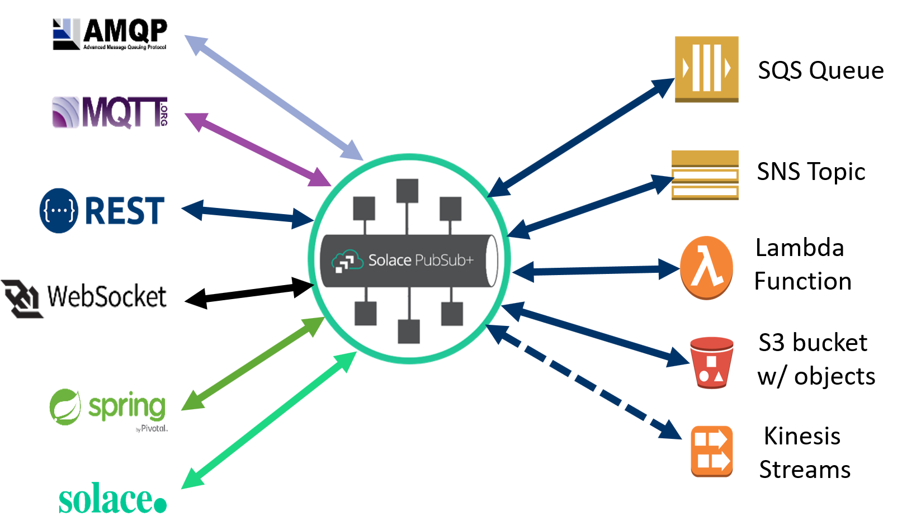
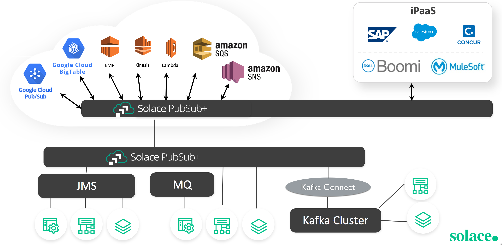
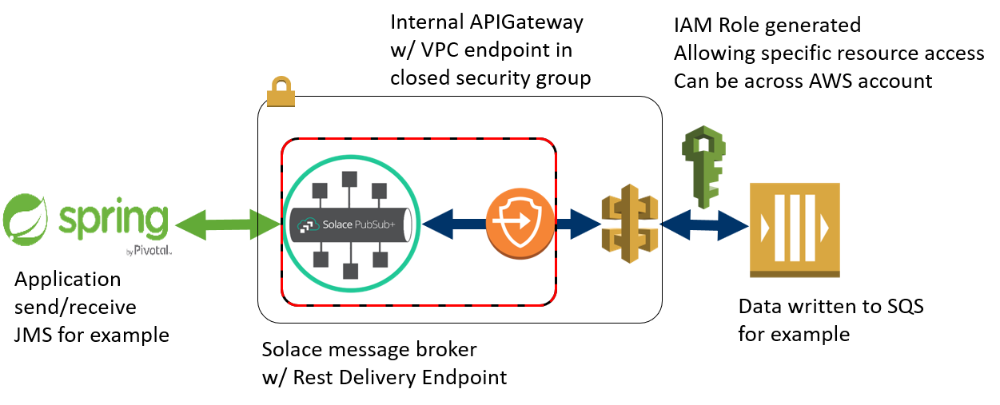

# solace-aws-service-integration 

## Synopsis

This repository provides a no code integration solution which allows applications connected to a Solace Event Mesh to interop with AWS datsa services.

Consider the following diagram:

It does not matter if the application communicates with the Solace broker in AWS via a REST POST or an AMQP, JMS or MQTT message, it can be sent automatically to AWS services and depending on the service asyncronously receive or poll for messages.

The Event Mesh is a clustered group of Solace PubSub+ Brokers that transparently, in real-time, route data events to any Service that is part of the Event Mesh. Solace PubSub+ Brokers (Appliances, Software and SolaceCloud) are connected to each other as a multi-connected mesh that to individual services (consumers or producers of data events) appears to be a single Event Broker. Events messages are seamlessly transported within the entire Solace Event Mesh regardless of where the event is created and where the process exists that has registered interested in consuming the event. Simply by having a Solace PubSub+ broker in AWS connected to the Event Mesh, the entire Event Mesh becomes aware of the registration request and will know how to securely route the appropriate events to and from AWS services.
This AWS intergration solution allows any event from any service in the Solace Event Mesh to send to be captured in an SQS queue, SNS topic, S3 bucket or invoke a Lambda function or be injested into a Kinesis stream. It does not matter which service in the Event Mesh created the event, the events are all potentially available to AWS services. There is no longer a requirement to code end applications to reach individual public cloud services.
This AWS integration also eliminates the need for bestoke bridges or gateways that need to be made resilient, maintained and operated. 

## Usage

### Detailed Topology Example

Breaking down the above diagram into it's component parts:
1. End application - In this example a Spring app communicating with JMS is outside the scope of this solution and is assumed to pre-exist.  It would communicate with the Solace message broker in normal fassion.

2. Solace Message Broker - Can be optionally provided or defined within the solution.  Will terminate the application connections, and deliver messages via Rest Delivery Endpoints to the APIGateway.

3. VPC Endpoint - Defined within solution, provides a private interface to the APIGateway from within the defined subnet only.

4. Security Group - Defined within solution.  Allows only the created Message Broker(s) to communicate with the APIGateway.  This is based on security group membership no IPs or other credentials.

5. APIGateway - Defined within solution. Converts the Solace provided message to a signed REST call formatted for the target downstream resource,(SQS, SNS, S3, Lambda, Kinesis).

6. IAM Role - Defined within solution. Allows read/write access to the sepcific downstream resouce, can be across accounts.

7. AWS Resource.  In this example tan S3 bucket is outside the scope of this solution and is assumed to pre-exist.  API gateway can write to a specific object or read from it.

### Minimum Resource Requirements
Below is the list of AWS resources that will be deployed by the Quick Start. Please consult the [Amazon VPC Limits](https://docs.aws.amazon.com/AmazonVPC/latest/UserGuide/VPC_Appendix_Limits.html ) page and ensure that your AWS region is within the limit range per resource before launching:

| Resource                   | Deploy |
|----------------------------|--------|
| VPCs                       |   1    |
| subnets                    |   1    |
| Running Instances          |   1    |
| API Gateways               |   1    |
| Endpoints                  |   1    |
| Security Groups            |   3    |

### Required IAM Roles
#### Default Group Policies
    AmazonEC2FullAccess
    AmazonS3FullAccess
#### Additional Policies
    AmazonAPIGatewayAdministration
    AmazonAPIGatewayPushToCloudWatchLogs
    AWSCloudFormationReadOnlyAccess
    IAMReadOnlyAccess
#### Additional individual permissions
    "cloudformation:CreateStack*",
    "cloudformation:DeleteStack",
    "iam:AddRoleToInstanceProfile",
    "iam:CreateInstanceProfile",
    "iam:CreateRole",
    "iam:CreatePolicy",
    "iam:PutRolePolicy",
    "iam:PassRole",
    "iam:DeleteRole",
    "iam:DeletePolicy",
    "iam:DeleteRolePolicy",
    "iam:DeleteInstanceProfile",
    "iam:RemoveRoleFromInstanceProfile",
    "logs:PutRetentionPolicy",
    "logs:DeleteLogGroup"

## Deploying solution
The solution is deployed via Cloud Formation templates.   It can either deploy the entire solution including Solace message broker and configure the rest delivery endpoints, set up the security group and endpoint as well as the APIGateway. Or, just deploy the AWS components and allow the administrator to configure an existing Solace message broker.

## Contributing

Please read [CONTRIBUTING.md](CONTRIBUTING.md) for details on our code of conduct, and the process for submitting pull requests to us.

## Authors

See the list of [contributors](../../graphs/contributors) who participated in this project.

## License

This project is licensed under the Apache License, Version 2.0. - See the [LICENSE](LICENSE) file for details.

## Resources

For more information about Solace technology in general please visit these resources:

- The Solace Developer Portal website at: http://dev.solace.com
- Understanding [Solace technology.](http://dev.solace.com/tech/)
- Ask the [Solace community](http://dev.solace.com/community/).